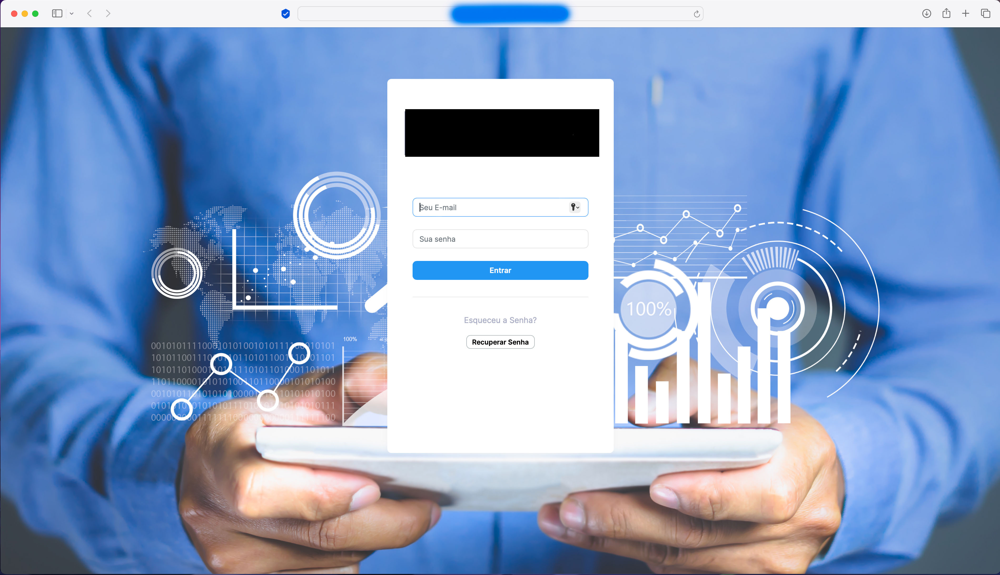
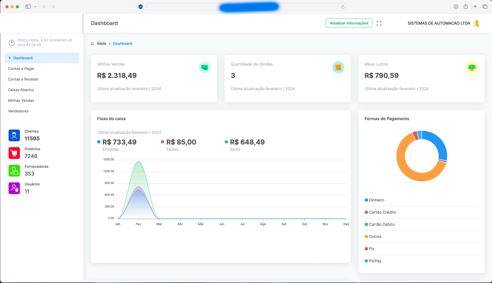
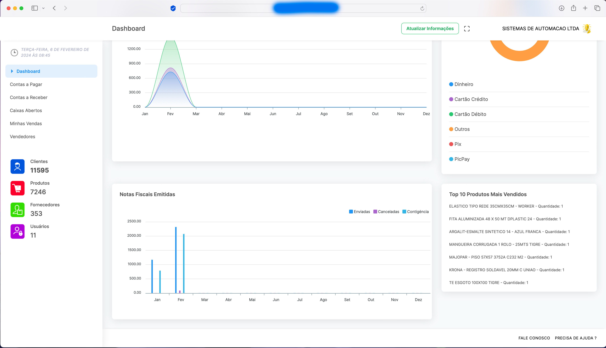
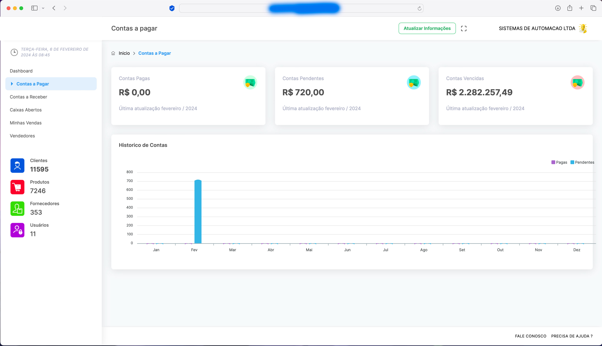
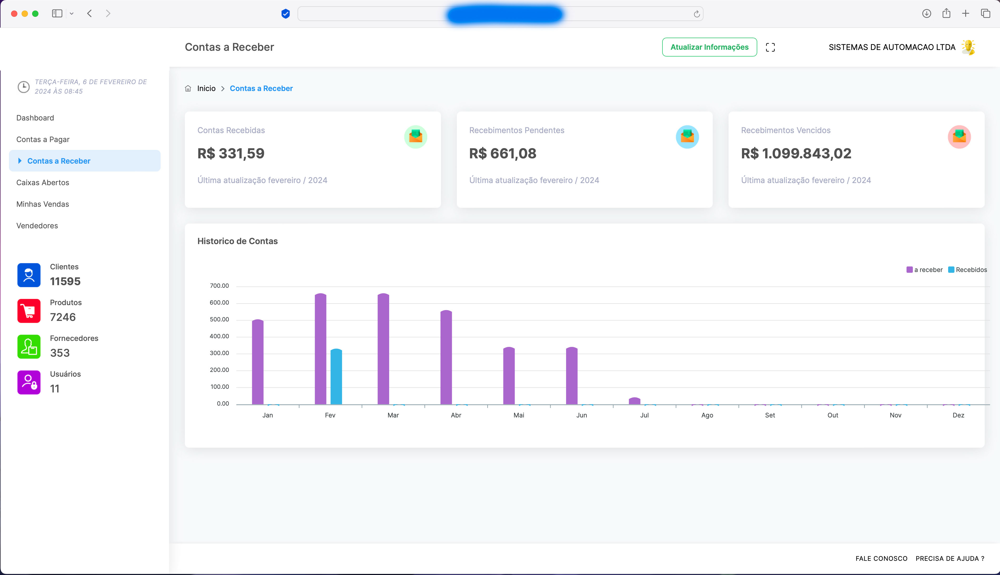
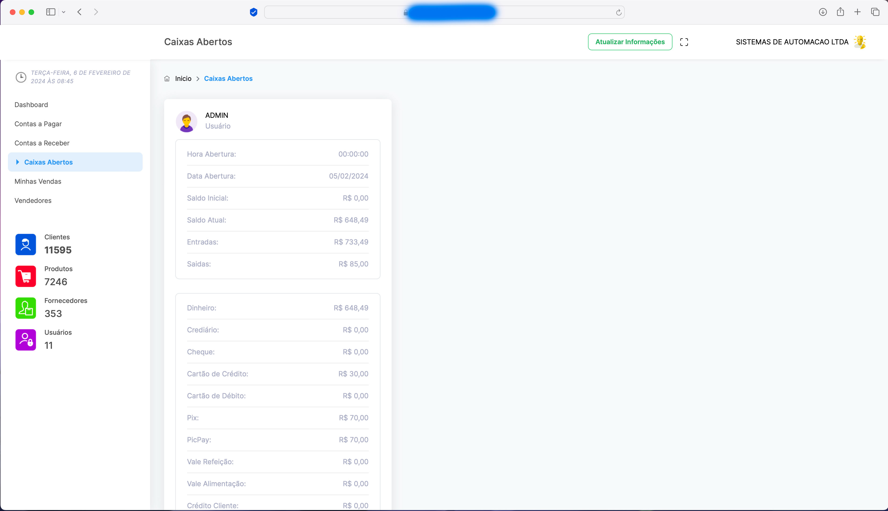
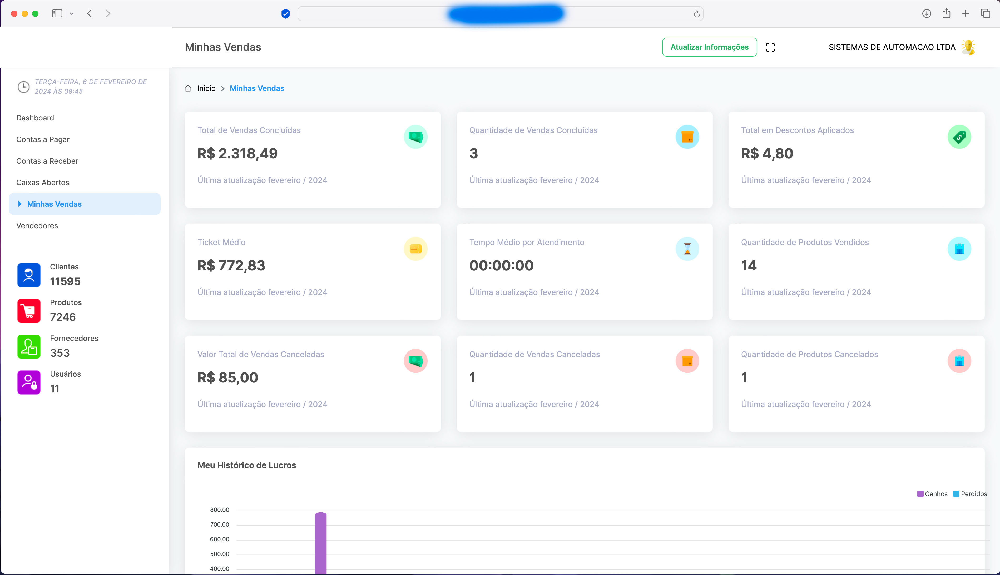
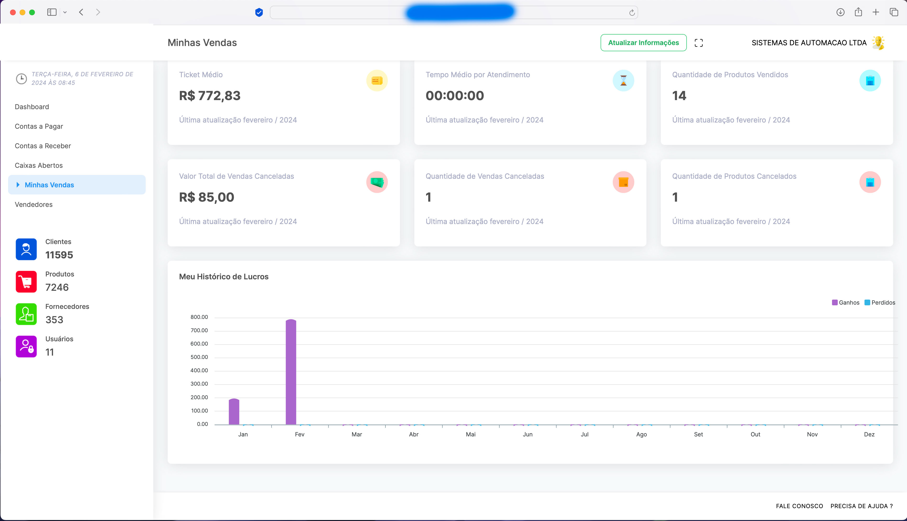
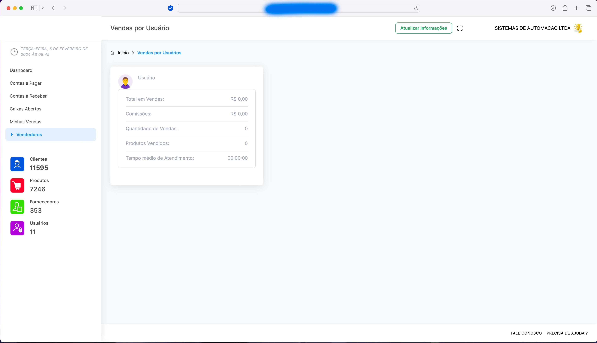

# Plataforma Dashboard

Plataforma Dashboard com código-fonte para integração ao seu sistema.

Tenha controle total da sua empresa de onde estiver: faça seu sistema enviar os dados financeiros para a web e acompanhe tudo na palma da mão.

## Principais recursos

- Informações financeiras
- Gráficos
- Contas a pagar: pendentes e vencidas
- Contas a receber: pendentes e vencidas
- Caixas
- Vendas e vendas por vendedor
- Perfil
- Top 10 dos produtos mais vendidos
- Notas fiscais emitidas
- Formas de pagamento mais usadas
- Lucros
- Quantidade de vendas
- Fluxo de caixa
- Quantidade de clientes, produtos, fornecedores e usuários

## Tecnologias e integração

- Código-fonte em Laravel
- Banco de dados MySQL
- Demonstração com código-fonte em Delphi
- API de integração para qualquer linguagem

## Imagens

## Estrutura do projeto

- `src/web/dashboard`: aplicação web em Laravel
- `img`: imagens de apresentação e descrição original

> O arquivo de ambiente da aplicação (`.env`) não faz parte do repositório. Use `src/web/dashboard/.env.example` como base para a configuração local.
